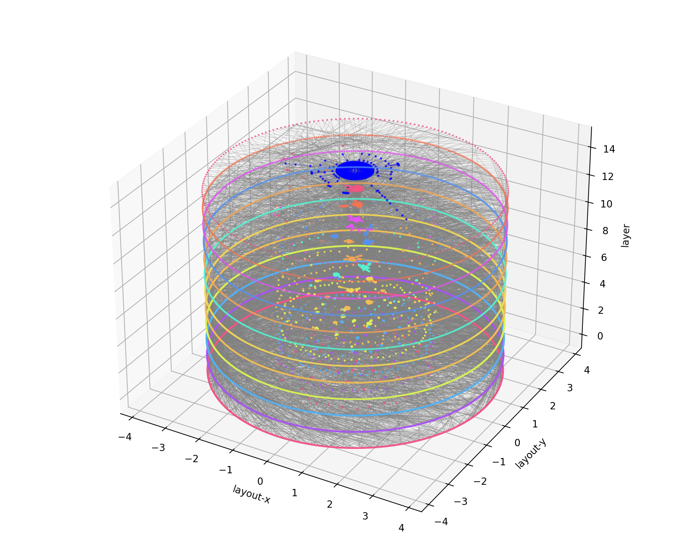

# Graph Path Likelihood for Galaxy Formation on Layered Halo Graphs

- This repository presents the training and inference workflow used in https://arxiv.org/pdf/2603.15128
- The layered halo graph organizes the merger histories of a main halo and its subhalos into a single, connected layered object, explicitly encoding spatial connections via host edges and causal connections through temporal edges. 
- The graph bundle under `dataGraphs/` contains the TNG-derived layered graphs used by the training and test lists. To save space, these graphs may be stored as individual `.json.gz` files. The convenience scripts below restore them automatically when needed. All graphs under `dataGraphs/` were constructed from the publicly available IllustrisTNG TNG50-1 data, which can be accessed at `www.tng-project.org/data`.



Rank-1 layered halo graph constructed from the TNG50-1 data.

For any questions, comments, and potential collaborations, please contact [yangdn_at_pmo.ac.cn].

---

This codebase is set up for two workflows:

- train a GPLM checkpoint on layered halo graphs,
- apply the shipped checkpoint to test graphs,
- compare the checkpoint against the deterministic transport-only baseline,
- generate the stacked parity and redshift-dependent residual plots used for basic model validation.

A trained checkpoint is available:

- `checkpoints/gplm_host.pt`

## Repository Layout

- `cli/train_gplm.py`: train GPLM from a graph list.
- `cli/apply_gplm.py`: paint predictions onto layered graphs using a checkpoint.
- `cli/apply_transport_only.py`: deterministic transport-only baseline.
- `gplm/`: GPLM model, feature construction, loss, inference, and export code.
- `jf_*.py`: layered-graph I/O, transport, and helper utilities.
- `plot_parity_stacked.py`: stacked transport-only vs GPLM parity plots.
- `plot_residuals_by_redshift_merged.py`: redshift-dependent residual comparison.
- `run_gplm.sh`: example training script for a new host-conditioned checkpoint.
- `run_gplm_checkpoint_demo.sh`: apply `checkpoints/gplm_host.pt` without retraining and regenerate the example validation figures.
- `run_transport_only.sh`: deterministic transport-only painting helper.
- `ensure_graph_jsons.sh`: restore compressed graph JSONs automatically when needed.
- `compress_data_graphs.sh`: gzip each graph JSON individually and verify the compressed file is below 25 MB.
- `decompress_data_graphs.sh`: restore all compressed graph JSONs.

## Data Files

- `train_paths.txt`: training graphs.
- `test_graphs.txt`: test graphs.
- `allgraphs.txt`: full list of graphs included.  

The graph files live under `dataGraphs/`. For distribution, they can be stored as individual `.json.gz` files. The convenience scripts restore them automatically. If you want to do that explicitly, use:

```bash
bash decompress_data_graphs.sh
```

To recompress them afterward:

```bash
bash compress_data_graphs.sh
```

By default, `compress_data_graphs.sh` replaces each `.json` with a `.json.gz` archive and aborts if any compressed file is not strictly smaller than 25 MB. `decompress_data_graphs.sh` restores the `.json` files while keeping the archives; set `DELETE_ARCHIVES=1` if you want the `.gz` files removed during decompression.

## Dependencies

The code requires:

- `numpy`
- `matplotlib`
- `scipy`
- `torch`
- `torch_geometric`

## Regenerate the Example Outputs from the Shipped Checkpoint

A demo application:

```bash
bash run_gplm_checkpoint_demo.sh
```

This:

- restores the compressed graph JSONs if needed,
- paints the deterministic transport-only baseline into `painted_transport/`,
- paints GPLM predictions from `checkpoints/gplm_host.pt` into `painted_gplm/`,
- regenerates `figs/parity_stacked_M_star.png`, `figs/parity_stacked_M_gas.png`, and `figs/residuals_by_redshift_merged.png`

Useful overrides:

- `DEVICE=cpu` or `DEVICE=cuda`
- `CHECKPOINT=...`
- `TEST_LIST=...`

Example:

```bash
DEVICE=cuda bash run_gplm_checkpoint_demo.sh
```

## Train a New Checkpoint

The shipped training script reproduces the active host-conditioned GPLM setup. Its defaults are aligned with the configuration stored in the shipped `gplm_host.pt`, so retraining with the same setup reproduces the same model class up to ordinary seed-level variation.

```bash
bash run_gplm.sh
```

This writes:

- `checkpoints/gplm_host.pt`
- `painted_transport/`
- `painted_gplm/`
- `figs/parity_stacked_M_star.png`
- `figs/parity_stacked_M_gas.png`
- `figs/residuals_by_redshift_merged.png`

Useful overrides:

- `DEVICE=cpu` or `DEVICE=cuda`
- `SEED=1234`
- `TRAIN_LIST=...`
- `TEST_LIST=...`
- `CHECKPOINT=...`

Example:

```bash
DEVICE=cuda SEED=1234 CHECKPOINT=checkpoints/gplm_host_retrained.pt bash run_gplm.sh
```

## Manual Checkpoint Example

The shipped checkpoint can also be applied manually without using the wrapper:

```bash
python cli/apply_transport_only.py \
  --fields M_star,M_gas \
  --target-list test_graphs.txt \
  --out-dir painted_transport

python cli/apply_gplm.py \
  --checkpoint checkpoints/gplm_host.pt \
  --fields M_star,M_gas \
  --target-list test_graphs.txt \
  --out-dir painted_gplm \
  --device auto \
  --spatial-features on \
  --mass-log-eps 0.1

python plot_parity_stacked.py \
  --truth-list test_graphs.txt \
  --transport-dir painted_transport \
  --pred-dir painted_gplm \
  --out-prefix figs/parity_stacked \
  --plot-eps 0.0

python plot_residuals_by_redshift_merged.py \
  --truth-list test_graphs.txt \
  --transport-dir painted_transport \
  --pred-dir painted_gplm \
  --out figs/residuals_by_redshift_merged.png
```

## Notes

- The transport-only baseline seeds newly entering nodes from the simulation truth at entry.
- The validation plots exclude those newly entering nodes by default.
- The active checkpoint uses host-edge message passing together with local environment features and spatial host-relative features.
- The training and checkpoint-demo wrappers automatically restore compressed graph JSONs if only `.json.gz` archives are present.
